# AI-Bots Architecture Diagrams

## 1. Overall System Architecture

---

## 2. LLM Provider Architecture (After Migration)

---

## 3. Input Routing Flow

---

## 4. Provider Fallback Mechanism

---

## 5. Intent Classification Logic

---

## 6. Voice-to-Voice Pipeline

```mermaid
graph LR
    A[🎤 Voice Input] --> B[Input Router]
    B --> C[Azure Speech-to-Text]
    C --> D[Text Transcription]
    D --> E[Intent Classifier]
    
    E -->|Repo| F[Qdrant Backend]
    E -->|General| G[Azure OpenAI]
    
    F --> H[Response Generator]
    G --> H
    
    H --> I[Azure Text-to-Speech]
    I --> J[🔊 Voice Output]
    
    style C fill:#0078d4,color:#fff
    style I fill:#0078d4,color:#fff
```

---

## 7. Module Dependencies

---

## 8. Configuration Hierarchy

---

## 9. Data Flow: Voice Query to Audio Response

```mermaid
sequenceDiagram
    autonumber
    actor User
    participant UI as Frontend UI
    participant API as HTTP API
    participant Router as Input Router
    participant STT as Azure STT
    participant Intent as Intent Classifier
    participant Backend as Qdrant/Azure AI
    participant LLM as Azure OpenAI
    participant TTS as Azure TTS
    
    User->>UI: 🎤 Voice Recording
    UI->>API: POST /api/v1/input/voice
    API->>Router: Route input
    Router->>STT: Transcribe audio
    STT-->>Router: Text + Language
    
    Router->>Intent: Classify intent
    Intent-->>Router: is_repo_related=true
    
    alt Repo-related
        Router->>Backend: Query Qdrant
        Backend-->>LLM: Code context
    else General
        Router->>LLM: Direct query
    end
    
    LLM-->>API: Response text
    API->>TTS: Synthesize speech
    TTS-->>API: Audio data
    API-->>UI: Text + Audio
    UI-->>User: 🔊 Play audio + Display text
```

---

## 10. Error Handling & Fallback Flow

```mermaid
graph TD
    A[Request] --> B{Azure OpenAI}
    B -->|Success| C[✅ Return Response]
    B -->|Timeout| D{Retry Logic}
    B -->|Auth Error| E{Check Config}
    B -->|Rate Limit| F{Wait & Retry}
    B -->|Other Error| G{Fallback to Together AI}
    
    D -->|Retry| B
    D -->|Max Retries| G
    
    E -->|Invalid| H[❌ Config Error]
    E -->|Valid| B
    
    F -->|Wait| B
    F -->|Max Wait| G
    
    G -->|Success| C
    G -->|Failure| I[❌ All Providers Failed]
    
    style C fill:#51cf66,color:#fff
    style H fill:#fa5252,color:#fff
    style I fill:#fa5252,color:#fff
```

---

## Key Architecture Decisions

### 1. **Azure as Default Provider**
- Primary: Azure OpenAI (Enterprise-grade, compliance)
- Fallback: Together AI (Cost-effective, fast)

### 2. **Layered Architecture**
- Frontend → API → Orchestration → Services → Providers
- Clear separation of concerns
- Easy to test and maintain

### 3. **Intent-Based Routing**
- Repo-related queries → Qdrant + Code AI
- General queries → Azure OpenAI
- Automatic classification based on keywords/patterns

### 4. **Voice-First Design**
- Azure Speech-to-Text for input
- Azure Text-to-Speech for output
- Support for multiple languages

### 5. **Flexible Configuration**
- Environment-based settings
- Role-based provider assignment
- Easy to switch providers

---

## Performance Targets

| Component | Target Latency |
|-----------|----------------|
| Speech-to-Text | < 2 seconds |
| Intent Classification | < 100ms |
| Azure OpenAI LLM | < 3 seconds |
| Text-to-Speech | < 3 seconds |
| **Total (Voice-to-Voice)** | **< 10 seconds** |

---

**Generated**: October 22, 2025  
**Version**: 1.0
