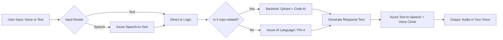

# AI-Bots Integration Plan & Development Sequence

## Overview
This document outlines the step-by-step plan for integrating voice and text input/output capabilities with Azure AI services, Qdrant vector database, and custom AI orchestration.

---

## Architecture Flow



---

## Phase 1: Core Infrastructure Setup

### 1.1 Azure Services Configuration
**Location**: `shared/azure_services/`

**Tasks**:
- [ ] Create `azure_services/__init__.py`
- [ ] Create `azure_services/speech_service.py`
  - Implement Speech-to-Text (STT)
  - Implement Text-to-Speech (TTS)
  - Add voice cloning configuration
- [ ] Create `azure_services/language_service.py`
  - Integrate Azure OpenAI or Phi-4
  - Add intent detection
  - Add conversational AI capabilities
- [ ] Create `azure_services/config.py`
  - Store API keys and endpoints
  - Add environment variable management

**Dependencies**:
- `azure-cognitiveservices-speech`
- `azure-ai-language-conversations`
- `openai` or `azure-openai`

**Estimated Time**: 2-3 days

---

### 1.2 Input Router Implementation
**Location**: `shared/routing/`

**Tasks**:
- [ ] Create `routing/__init__.py`
- [ ] Create `routing/input_router.py`
  - Implement input type detection (voice vs text)
  - Add input validation
  - Add error handling
- [ ] Create `routing/intent_classifier.py`
  - Implement repo-related vs non-repo classification
  - Add keyword-based detection
  - Add ML-based intent detection (optional)

**Dependencies**:
- Built-in Python libraries
- Optional: `scikit-learn` for ML-based classification

**Estimated Time**: 2 days

---

## Phase 2: Backend Integration

### 2.1 Vector Database Enhancement
**Location**: `vector_db/`

**Tasks**:
- [ ] Review existing Qdrant integration in `vector_db/`
- [ ] Create `vector_db/query_handler.py`
  - Implement semantic search for code queries
  - Add context retrieval
  - Add result ranking
- [ ] Create `vector_db/embeddings.py`
  - Add embedding generation for queries
  - Add caching mechanism

**Dependencies**:
- `qdrant-client`
- `sentence-transformers` or Azure OpenAI embeddings

**Estimated Time**: 3 days

---

### 2.2 Repository Context Handler
**Location**: `orchestration/repo_handler/`

**Tasks**:
- [ ] Create `repo_handler/__init__.py`
- [ ] Create `repo_handler/context_builder.py`
  - Extract relevant code snippets
  - Build context from Qdrant results
  - Format context for LLM consumption
- [ ] Create `repo_handler/code_analyzer.py`
  - Analyze code structure
  - Extract dependencies
  - Identify relevant files

**Estimated Time**: 3-4 days

---

## Phase 3: Orchestration Layer

### 3.1 Main Orchestrator
**Location**: `orchestration/`

**Tasks**:
- [ ] Review existing orchestration in `orchestration/`
- [ ] Create `orchestration/main_orchestrator.py`
  - Implement main workflow controller
  - Add event-driven architecture
  - Add async processing support
- [ ] Create `orchestration/response_generator.py`
  - Combine results from different sources
  - Format final response
  - Add response validation

**Dependencies**:
- `asyncio`
- `aiohttp`

**Estimated Time**: 3 days

---

### 3.2 Pipeline Implementation
**Location**: `orchestration/pipelines/`

**Tasks**:
- [ ] Create `pipelines/__init__.py`
- [ ] Create `pipelines/voice_pipeline.py`
  - Voice input → STT → Logic → Response → TTS
  - Add error recovery
  - Add timeout handling
- [ ] Create `pipelines/text_pipeline.py`
  - Text input → Logic → Response → (Optional TTS)
  - Add streaming support
  - Add rate limiting

**Estimated Time**: 2-3 days

---

## Phase 4: Frontend Integration

### 4.1 Voice Input Component
**Location**: `frontend/components/`

**Tasks**:
- [ ] Create voice recording component
  - Add microphone permission handling
  - Add audio recording UI
  - Add real-time audio visualization
- [ ] Implement audio upload to backend
  - Add file format validation
  - Add compression
  - Add progress tracking

**Technologies**: React/Vue/HTML5 Web Audio API

**Estimated Time**: 3 days

---

### 4.2 Text Input Component
**Location**: `frontend/components/`

**Tasks**:
- [ ] Create text input component
  - Add rich text editor
  - Add autocomplete
  - Add command suggestions
- [ ] Implement WebSocket or SSE for real-time responses

**Estimated Time**: 2 days

---

### 4.3 Audio Output Component
**Location**: `frontend/components/`

**Tasks**:
- [ ] Create audio player component
  - Add playback controls
  - Add audio visualization
  - Add download option
- [ ] Implement audio streaming from backend
  - Add buffering
  - Add error handling

**Estimated Time**: 2 days

---

## Phase 5: API Layer

### 5.1 REST API Endpoints
**Location**: `interfaces/http_api/`

**Tasks**:
- [ ] Review existing API in `interfaces/`
- [ ] Add `/api/v1/input/voice` endpoint
  - Accept audio files
  - Trigger voice pipeline
  - Return transcription and response
- [ ] Add `/api/v1/input/text` endpoint
  - Accept text queries
  - Trigger text pipeline
  - Return response
- [ ] Add `/api/v1/output/audio` endpoint
  - Stream audio responses
  - Support different audio formats
- [ ] Add `/api/v1/status` endpoint
  - Check processing status
  - Return pipeline progress

**Dependencies**:
- `fastapi` or `flask`
- `uvicorn` or `gunicorn`

**Estimated Time**: 3 days

---

### 5.2 WebSocket Support
**Location**: `interfaces/websocket/`

**Tasks**:
- [ ] Create WebSocket handler
  - Support real-time voice streaming
  - Support real-time text chat
  - Add session management
- [ ] Implement bidirectional communication
  - Stream audio chunks
  - Stream text responses

**Estimated Time**: 2-3 days

---

## Phase 6: Testing & Observability

### 6.1 Unit Tests
**Location**: `tests/unit/`

**Tasks**:
- [ ] Test Azure services integration
- [ ] Test input routing logic
- [ ] Test Qdrant queries
- [ ] Test response generation
- [ ] Test audio processing

**Estimated Time**: 3 days

---

### 6.2 Integration Tests
**Location**: `tests/integration/`

**Tasks**:
- [ ] Test end-to-end voice pipeline
- [ ] Test end-to-end text pipeline
- [ ] Test error scenarios
- [ ] Test concurrent requests

**Estimated Time**: 2 days

---

### 6.3 Observability Enhancement
**Location**: `observability/`

**Tasks**:
- [ ] Add logging for all pipelines
- [ ] Add metrics collection
  - Request count
  - Response time
  - Error rate
  - Audio processing time
- [ ] Add tracing
  - OpenTelemetry integration
  - Request flow tracking

**Dependencies**:
- `opentelemetry`
- `prometheus-client`

**Estimated Time**: 2 days

---

## Phase 7: Deployment & Documentation

### 7.1 Deployment Configuration
**Location**: Root directory

**Tasks**:
- [ ] Update `docker-compose.yml`
  - Add Azure services configuration
  - Add environment variables
  - Add volume mappings
- [ ] Create Kubernetes manifests (optional)
- [ ] Create deployment scripts
- [ ] Add CI/CD pipeline configuration

**Estimated Time**: 2 days

---

### 7.2 Documentation
**Location**: `docs/`

**Tasks**:
- [ ] API documentation
  - OpenAPI/Swagger specs
  - Request/response examples
- [ ] Developer guide
  - Setup instructions
  - Architecture overview
  - Code examples
- [ ] User guide
  - Feature descriptions
  - Usage examples

**Estimated Time**: 2 days

---

## Development Sequence

### Sprint 1 (Week 1-2): Foundation
1. Azure Services Configuration (1.1)
2. Input Router Implementation (1.2)
3. API endpoints skeleton (5.1)

### Sprint 2 (Week 3-4): Backend
1. Vector Database Enhancement (2.1)
2. Repository Context Handler (2.2)
3. Basic unit tests (6.1)

### Sprint 3 (Week 5-6): Orchestration
1. Main Orchestrator (3.1)
2. Pipeline Implementation (3.2)
3. Integration tests (6.2)

### Sprint 4 (Week 7-8): Frontend
1. Voice Input Component (4.1)
2. Text Input Component (4.2)
3. Audio Output Component (4.3)

### Sprint 5 (Week 9-10): Integration & Polish
1. WebSocket Support (5.2)
2. Observability Enhancement (6.3)
3. End-to-end testing

### Sprint 6 (Week 11-12): Deployment
1. Deployment Configuration (7.1)
2. Documentation (7.2)
3. Performance optimization
4. Production deployment

---

## Key Technical Decisions

### 1. **Input Processing**
- **Voice**: Use Azure Speech SDK with streaming support
- **Text**: Direct processing with validation

### 2. **Intent Classification**
- **Primary**: Keyword-based classification (fast, reliable)
- **Fallback**: Azure Language Service for ambiguous queries

### 3. **Vector Search**
- **Engine**: Qdrant (already integrated)
- **Embeddings**: Azure OpenAI `text-embedding-ada-002` or open-source alternative

### 4. **Response Generation**
- **Repo queries**: Qdrant + Code AI (custom model or GPT-4)
- **General queries**: Azure OpenAI GPT-4 or Phi-4

### 5. **Audio Output**
- **TTS**: Azure Neural TTS
- **Voice Clone**: Azure Custom Neural Voice or third-party service

### 6. **Communication Protocol**
- **REST**: For stateless operations
- **WebSocket**: For real-time voice streaming

---

## Environment Variables Required

```bash
# Azure Speech Services
AZURE_SPEECH_KEY=
AZURE_SPEECH_REGION=
AZURE_CUSTOM_VOICE_ENDPOINT=

# Azure OpenAI / Language
AZURE_OPENAI_KEY=
AZURE_OPENAI_ENDPOINT=
AZURE_OPENAI_DEPLOYMENT=
AZURE_LANGUAGE_KEY=
AZURE_LANGUAGE_ENDPOINT=

# Qdrant
QDRANT_HOST=
QDRANT_PORT=
QDRANT_API_KEY=
QDRANT_COLLECTION=

# Application
LOG_LEVEL=INFO
MAX_AUDIO_SIZE_MB=10
VOICE_TIMEOUT_SECONDS=30
```

---

## Success Metrics

1. **Performance**
   - STT latency: < 2 seconds
   - Response generation: < 5 seconds
   - TTS latency: < 3 seconds
   - End-to-end: < 10 seconds

2. **Accuracy**
   - Intent classification: > 95%
   - Repo-related queries: > 90% relevant results
   - Speech recognition: > 95% accuracy

3. **Reliability**
   - Uptime: > 99.9%
   - Error rate: < 1%
   - Concurrent users: Support 100+ simultaneous requests

---

## Risk Mitigation

1. **Azure Service Outages**: Implement retry logic and fallback mechanisms
2. **High Latency**: Add caching, optimize queries, use CDN for audio
3. **Concurrent Load**: Implement rate limiting, queue management
4. **Voice Quality**: Test multiple TTS voices, add quality controls
5. **Security**: Implement authentication, input validation, rate limiting

---

## Next Steps

1. Review and approve this plan
2. Set up Azure resources and obtain API keys
3. Create feature branches for each phase
4. Begin Sprint 1 implementation
5. Set up CI/CD pipeline
6. Schedule weekly review meetings

---

**Last Updated**: October 22, 2025  
**Version**: 1.0  
**Owner**: Development Team
